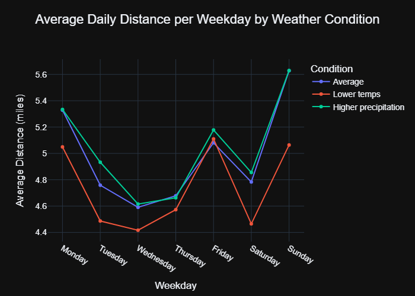

# Polars Taxi Data Example

## Overview

This notebook showcases how I use **[Polars](https://pola.rs)** for fast and efficient data analysis. I work with the NYC Yellow Taxi dataset and combine it with NYC daily weather to explore how weather affects taxi usage.

## What It Shows

* Loading and analyzing millions of taxi trip records using **lazy Polars DataFrames**
* Aggregating trips by hour and day to calculate averages (e.g. distance, fare)
* Joining taxi data with weather data (temp, precipitation)
* Plotting trends with **Plotly**, like how trip distances vary with weather

## Tools Used

* **Polars** for fast DataFrame processing
* **Plotly** for visualizations
* **Kagglehub** to load data directly from Kaggle
* **Jupyter Notebook** for running everything interactively

## How to Run

1. Install dependencies:

   ```bash
   pip install -r requirements.txt
   ```

2. Run the notebook:

   ```bash
   jupyter notebook polars_example.ipynb
   ```

3. Make sure you have Kaggle API credentials set up to download the dataset.

## Example Result

The final chart compares taxi trip distances per weekday:

* On **colder days** (below average temp), people take fewer/shorter trips.
* On **rainy days**, trip distance looks similar to normal days, however the average daily distance is slightly higher.


